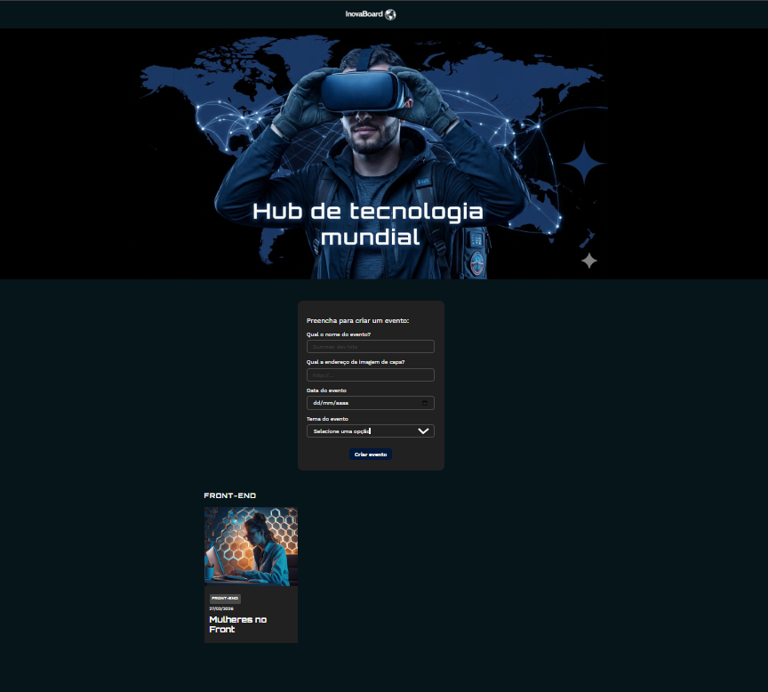

# Inova board

Um hub de eventos de tecnologia mundial! Este projeto foi construído com o objetivo educacional para a prática dos conhecimentos de React na versão 19 e com as funcionalidades de criação e visualização de eventos, organizados por temas como: Front-end, Back-end, Cloud e etc.

- Componentização no React.
- JSX.
- Manipulação de formulários e dados.
- Estilização com CSS.
- Uso de props e renderização condicional.



## Técnicas e tecnologias

- **React + Vite**: Estrutura leve para desenvolvimento com React.
- **useState**: Para gerenciamento do estado local dos eventos.
- **Componentização**: Separação clara de responsabilidades por componente.
- **Formulários com `FormData`**: Captura de dados estruturada.
- **CSS Modules**: style organizados por componente com escopo local.
- **Google Fonts (Work Sans + Orbitron)**: Tipografia personalizada.

## Como rodar o projeto

1. Clone o repositório:

```bash
git clone https://github.com/seu-usuario/inova-board.git
cd inova-board
```

2. Instale as dependências:

```bash
npm install
```

3. Rode o projeto localmente:

```bash
npm run dev
```

4. Acesse no navegador:

```
http://localhost:5173
```

**Imagens disponíveis:**

- `img_1.png` até `img_7.png`

**Formato de uso direto no projeto:**

```txt
https://raw.githubusercontent.com/thompsoncarlos/static-files/img_1.png
```


